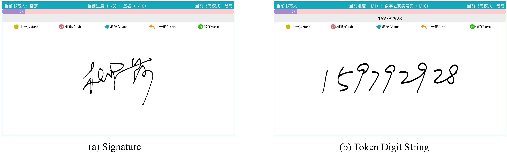
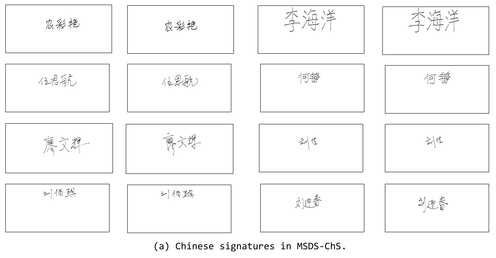
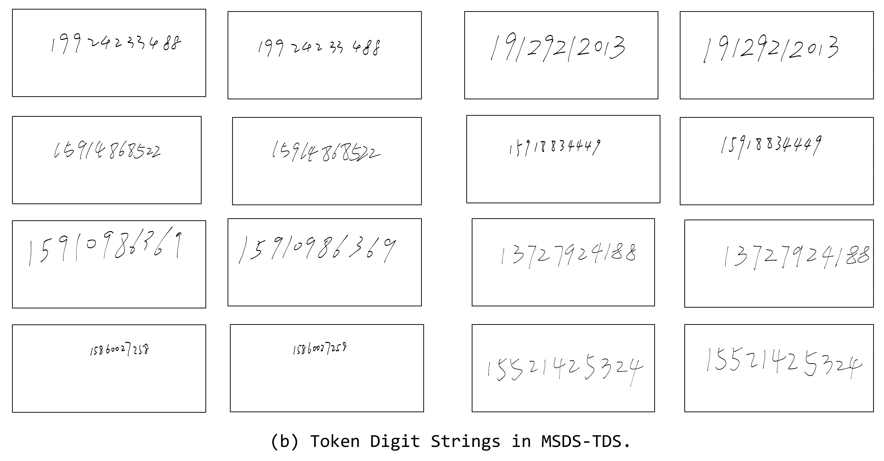

# MSDS Dataset Released

This is the released version of the MSDS dataset. The dataset can be downloaded in the following ways:

- [Baidu Cloud](https://pan.baidu.com/s/1k6vZ4tVnvL3JyY4I16CRjQ?pwd=062e)
- [Google Drive](https://drive.google.com/file/d/1FZNbFC_K4Co8t9nR8J3o_dNx1QiI2Utg/view?usp=sharing)

## Usage

- The MSDS dataset can only be used for non-commercial research purposes. For scholar or organization who wants to use the MSDS dataset, please first fill in this [Application Form](./application-form/Application-Form-for-Using-MSDS.docx) and email it to us. When submitting the application form to us, please list or attached 1-2 of your publications in the recent 6 years to indicate that you (or your team) do research in the related research fields of handwriting verification, handwriting analysis and recognition, document image processing, and so on. We will give you the decompression password after your letter has been received and approved.
- All applicants must sign a legal agreement that issued by us and promise to never use the data for any illegal purpose.

## Description

MSDS dataset is a handwriting verification benchmark dataset and consists of two subsets: MSDS-ChS (for Chinese signatures) and MSDS-TDS (for Token Digit Strings). Each subset contains 16080 samples from 402 users, with 20 genuine samples and 20 skilled forgeries per user. The details are presented below:

| Subset   | Content            | Online | Offline | User    | Genuine Sample                | Skilled Forgery               | Features                        |
| -------- | ------------------ | :----: | :-----: | ------- | ----------------------------- | ----------------------------- | ------------------------------- |
| MSDS-ChS | Chinese Signature  |   ✓   |   ✓   | 402 | $402\times(10 + 10) = 8040$ | $402\times(10 + 10) = 8040$ | $X,Y,P,T,I_r$ |
| MSDS-TDS | Token Digit String |   ✓   |   ✓   | 402 | $402\times(10 + 10) = 8040$ | $402\times(10 + 10) = 8040$ | $X,Y,P,T,I_r$ |

$X,Y,P,T,I_r$ respectively denote the $x, y$ coordinates, pressure, timestamps, and rendered static images.

The contributions of MSDS include:

- [X] MSDS-ChS is the largest publicly available Chinese signature dataset for signature for signature verification, at least eight times larger than existing ones.
- [X] MSDS-TDS is the first dataset that covers Token Digit String, which brings a new and effective biometric for handwriting verification.
- [x] The experimental results indicates that the Token Digit String is more powerful than Chinese signatures, which is inspiring and promising.

## Collection

The data of MSDS was acquired with two types of Android tablets. Both of them have specific stylus. We specifically developed an Android app and the user interface is shown below. Users directly performed handwriting on the tablets specific styluses and the produced information was automatically recorded by the app.



The data acquisition process is divided into two separate sessions with a time interval of at least 21 days. In each session, users performed writing according to the same procedure: 10 genuine signatures→10 genuine phone numbers→10 forged signatures→10 forged phone numbers.

## Responsible Use

MSDS is collected for handwriting identity verification. Specifically, the MSDS-ChS subset could be exploited in online/offline Chinese signature verification, and the MSDS-TDS subset is intended to be used in online/offline identity verification with Token Digit Strings. In addition, MSDS can be exploited in writer identification.

## Maintenance

Our dataset can be accessed through the aforementioned link. We will occasionally perform maintenance, such as providing data corrections and solving issues raised by developers.

## License

MSDS should be used and distributed under [Creative Attribution-NonCommercial-NoDerivatives 4.0 International (CC BY-NC-ND 4.0) License](https://creativecommons.org/licenses/by-nc-nd/4.0/) for non-commercial research purposes.

## Examples

Some examples of Chinese signatures and Token Digit Strings are shown as follows:



## Directory Format

The dataset is organized in the following directory format:

```bash
├─MSDS
│  ├─Chinese_Signature
│  │  ├─session1
│  │  │  ├─0
│  │  │  │  ├─images
│  │  │  │  │  ├─f_0_0.png
│  │  │  │  │  ├─f_0_1.png
│  │  │  │  │  ├─...
│  │  │  │  │  ├─g_0_0.png
│  │  │  │  │  ├─g_0_1.png
│  │  │  │  │  └─...
│  │  │  │  └─series
│  │  │  │  │  ├─f_0_0.txt
│  │  │  │  │  ├─f_0_1.txt
│  │  │  │  │  ├─...
│  │  │  │  │  ├─g_0_0.txt
│  │  │  │  │  ├─g_0_1.txt
│  │  │  │  │  └─...
│  │  │  ├─1
│  │  │  │  ├─images
│  │  │  │  │  ├─f_0_0.png
│  │  │  │  │  ├─f_0_1.png
│  │  │  │  │  ├─...
│  │  │  │  │  ├─g_0_0.png
│  │  │  │  │  ├─g_0_1.png
│  │  │  │  │  └─...
│  │  │  │  └─series
│  │  │  │  │  ├─f_0_0.txt
│  │  │  │  │  ├─f_0_1.txt
│  │  │  │  │  ├─...
│  │  │  │  │  ├─g_0_0.txt
│  │  │  │  │  ├─g_0_1.txt
│  │  │  │  │  └─...
│  │  │  └─...
│  │  └─session2
│  │      ├─...
│  └─Token_Digit_String
│  │  ├─session1
│  │  │  ├─0
│  │  │  │  ├─images
│  │  │  │  │  ├─f_0_0.png
│  │  │  │  │  ├─f_0_1.png
│  │  │  │  │  ├─...
│  │  │  │  │  ├─g_0_0.png
│  │  │  │  │  ├─g_0_1.png
│  │  │  │  │  └─...
│  │  │  │  └─series
│  │  │  │  │  ├─f_0_0.txt
│  │  │  │  │  ├─f_0_1.txt
│  │  │  │  │  ├─...
│  │  │  │  │  ├─g_0_0.txt
│  │  │  │  │  ├─g_0_1.txt
│  │  │  │  │  └─...
│  │  │  ├─1
│  │  │  │  ├─images
│  │  │  │  │  ├─f_0_0.png
│  │  │  │  │  ├─f_0_1.png
│  │  │  │  │  ├─...
│  │  │  │  │  ├─g_0_0.png
│  │  │  │  │  ├─g_0_1.png
│  │  │  │  │  └─...
│  │  │  │  └─series
│  │  │  │  │  ├─f_0_0.txt
│  │  │  │  │  ├─f_0_1.txt
│  │  │  │  │  ├─...
│  │  │  │  │  ├─g_0_0.txt
│  │  │  │  │  ├─g_0_1.txt
│  │  │  │  │  └─...
│  │  │  └─...
│      └─session2
│  │      ├─...
```

- The `Chinese_Signature` folder contains Chinese signatures and `Token_Digit_String` contains Token Digit Strings (TDS).
- Each of them contains the data in two sessions which is stored in `session1` and `session2`.
- The users are arranged from `0` to `401`, with online dynamic time series and offline static images provided in `series` and `images`. The time series are saved as `.txt` files and the images are in `.png` format.
- The naming of each file follows the same format: `flag_user_index`.
- - `flag` is `f` or `g`. `f` indicates that this file is a skilled forgery, while `g` indicates that it is a genuine sample.
- - `user` indicates the number of user of this file.
- - `index` indicates the number of this file (`.txt` or `.png`) in the current folder.
- - For example, `f_0_0.txt` represents the first file (time series) of all skilled forgeries of the user `0`. `g_5_6.png` represents the seventh file (image) of all genuine samples of the user `5`.

## ToDo
