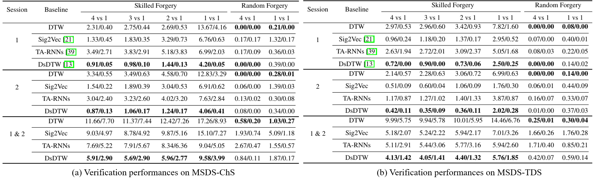

# MSDS Dataset Released

This is the released version and official page of the [MSDS dataset](https://proceedings.neurips.cc/paper_files/paper/2022/hash/eca896a8cf6363c9573a701c8c5c9cc5-Abstract-Datasets_and_Benchmarks.html) (NIPS 2022 Spotlight). You can access the dataset following the instructions.

## Directory

1. [Usage&Download](#Usage&Download)
2. [Description](#Description)
3. [Collection](#Collection)
4. [Responsible-Use](#Responsible-Use)
5. [Experimental-Result](#Experimental-Result)
6. [License](#License)
7. [Directory-Format](#Directory-Format)
8. [Copyright](#Copyright)

## Usage&Download

- The MSDS dataset can only be used for non-commercial research purposes. For scholar or organization who wants to use the MSDS dataset, please first fill in this [Application Form](./application-form/Application-Form-for-Using-MSDS.docx) and sign the [Legal Commitment](./application-form/Legal-Commitment.docx) and email them to us. When submitting the application form to us, please list or attached 1-2 of your publications in the recent 6 years to indicate that you (or your team) do research in the related research fields of handwriting verification, handwriting analysis and recognition, document image processing, and so on. 
- We will give you the download link and the decompression password after your application has been received and approved.
- All users must follow all use conditions; otherwise, the authorization will be revoked.

## Description

MSDS dataset is a handwriting verification benchmark dataset and consists of two subsets: MSDS-ChS (for Chinese signatures) and MSDS-TDS (for Token Digit Strings). Each subset contains 16080 samples from 402 users, with 20 genuine samples and 20 skilled forgeries per user. The details are presented below:

| Subset   | Content            | Online | Offline | User    | Genuine Sample                | Skilled Forgery               | Features                        |
| -------- | ------------------ | :----: | :-----: | ------- | ----------------------------- | ----------------------------- | ------------------------------- |
| MSDS-ChS | Chinese Signature  |   ✓   |   ✓   | 402 | $402\times(10 + 10) = 8040$ | $402\times(10 + 10) = 8040$ | $X,Y,P,T,I_r,U$ |
| MSDS-TDS | Token Digit String |   ✓   |   ✓   | 402 | $402\times(10 + 10) = 8040$ | $402\times(10 + 10) = 8040$ | $X,Y,P,T,I_r,U$ |

$X,Y,P,T,I_r,U$ respectively denote the $x, y$ coordinates, pressure, timestamps, rendered static images, and the pen-up/pen-down information. The pen-down/pen-up information is represented by 0~4. 0 indicates that this is not a pen-up/pen-down point. 1 indicates that this is a pen-down point. 2 indicates that this is a pen-up point. 3 indicates that this point is both a pen-up and pen-down point, which is isolated.

The contributions of MSDS include:

- [X] MSDS-ChS is the largest publicly available Chinese signature dataset for signature for signature verification, at least eight times larger than existing ones.
- [X] MSDS-TDS is the first dataset that covers Token Digit String, which brings a new and effective biometric for handwriting verification.
- [x] The experimental results indicates that the Token Digit String is more powerful than Chinese signature, which is inspiring and promising.

## Collection

The data of MSDS was acquired with two types of Android tablets. Both of them have specific stylus. We specifically developed an Android app and the user interface is shown below. Users directly performed handwriting on the tablets with specific styluses and the produced information was automatically recorded by the app.


The data acquisition process is divided into two separate sessions with a time interval of at least 21 days. In each session, users performed writing according to the same procedure: 10 genuine signatures→10 genuine phone numbers→10 forged signatures→10 forged phone numbers.

## Responsible-Use

MSDS is collected for handwriting identity verification. Specifically, the MSDS-ChS subset could be exploited in online/offline Chinese signature verification, and the MSDS-TDS subset is intended to be used in online/offline identity verification with Token Digit Strings. In addition, MSDS can be exploited in writer identification.

## Experimental-Result



Experimental results show all models perform better on MSDS-TDS than MSDS-ChS. This finding is inspiring that the accuracy of TDS verification is higher than that of Chinese signature verification as the two subsets were collected simultaneously. Therefore, Token Digit String could be a more effective biometric trait than Chinese signature for high-accurate online verification.

## License

MSDS should be used and distributed under [Creative Attribution-NonCommercial-NoDerivatives 4.0 International (CC BY-NC-ND 4.0) License](https://creativecommons.org/licenses/by-nc-nd/4.0/) for non-commercial research purposes.

## Directory-Format

The dataset is organized in the following directory format:

```bash
├─MSDS
│  ├─MSDS-ChS
│  │  ├─session1
│  │  │  ├─0
│  │  │  │  ├─images
│  │  │  │  │  ├─f_0_0.png
│  │  │  │  │  ├─f_0_1.png
│  │  │  │  │  ├─...
│  │  │  │  │  ├─g_0_0.png
│  │  │  │  │  ├─g_0_1.png
│  │  │  │  │  └─...
│  │  │  │  └─series
│  │  │  │  │  ├─f_0_0.txt
│  │  │  │  │  ├─f_0_1.txt
│  │  │  │  │  ├─...
│  │  │  │  │  ├─g_0_0.txt
│  │  │  │  │  ├─g_0_1.txt
│  │  │  │  │  └─...
│  │  │  ├─1
│  │  │  │  ├─images
│  │  │  │  │  ├─f_0_0.png
│  │  │  │  │  ├─f_0_1.png
│  │  │  │  │  ├─...
│  │  │  │  │  ├─g_0_0.png
│  │  │  │  │  ├─g_0_1.png
│  │  │  │  │  └─...
│  │  │  │  └─series
│  │  │  │  │  ├─f_0_0.txt
│  │  │  │  │  ├─f_0_1.txt
│  │  │  │  │  ├─...
│  │  │  │  │  ├─g_0_0.txt
│  │  │  │  │  ├─g_0_1.txt
│  │  │  │  │  └─...
│  │  │  └─...
│  │  └─session2
│  │      ├─...
│  └─MSDS-TDS
│  │  ├─session1
│  │  │  ├─0
│  │  │  │  ├─images
│  │  │  │  │  ├─f_0_0.png
│  │  │  │  │  ├─f_0_1.png
│  │  │  │  │  ├─...
│  │  │  │  │  ├─g_0_0.png
│  │  │  │  │  ├─g_0_1.png
│  │  │  │  │  └─...
│  │  │  │  └─series
│  │  │  │  │  ├─f_0_0.txt
│  │  │  │  │  ├─f_0_1.txt
│  │  │  │  │  ├─...
│  │  │  │  │  ├─g_0_0.txt
│  │  │  │  │  ├─g_0_1.txt
│  │  │  │  │  └─...
│  │  │  ├─1
│  │  │  │  ├─images
│  │  │  │  │  ├─f_0_0.png
│  │  │  │  │  ├─f_0_1.png
│  │  │  │  │  ├─...
│  │  │  │  │  ├─g_0_0.png
│  │  │  │  │  ├─g_0_1.png
│  │  │  │  │  └─...
│  │  │  │  └─series
│  │  │  │  │  ├─f_0_0.txt
│  │  │  │  │  ├─f_0_1.txt
│  │  │  │  │  ├─...
│  │  │  │  │  ├─g_0_0.txt
│  │  │  │  │  ├─g_0_1.txt
│  │  │  │  │  └─...
│  │  │  └─...
│      └─session2
│  │      ├─...
```

- The `MSDS-ChS` folder contains Chinese signatures and `MSDS-TDS` contains Token Digit Strings (TDS).
- Each of them contains the data in two sessions which is stored in `session1` and `session2`.
- The users are arranged from `0` to `401`, with online dynamic time series and offline static images provided in `series` and `images`. The time series are saved as `.txt` files and the images are in `.png` format.
- The naming of each file follows the same format: `flag_user_index`.
- - `flag` is `f` or `g`. `f` indicates that this file is a skilled forgery, while `g` indicates that it is a genuine sample.
- - `user` indicates the number of user of this file.
- - `index` indicates the number of this file (`.txt` or `.png`) in the current folder.
- - For example, `f_0_0.txt` represents the first file (time series) of all skilled forgeries of the user `0`. `g_5_6.png` represents the seventh file (image) of all genuine samples of the user `5`.

## Citation

```
@inproceedings{zhang2022msds,
    author = {Zhang, Peirong and Jiang, Jiajia and Liu, Yuliang and Jin, Lianwen},
    booktitle = {{Advances in Neural Information Processing Systems}},
    pages = {36507--36519},
    title = {{MSDS: A Large-Scale Chinese Signature and Token Digit String Dataset for Handwriting Verification}},
    volume = {35},
    year = {2022}
}
```

## Copyright

For commercial purpose usage, please contact Prof. Lianwen Jin: eelwjin@scut.edu.cn.

Copyright 2022, Deep Learning and Vision Computing Lab, South China China University of Technology. http://www.dlvc-lab.net.
